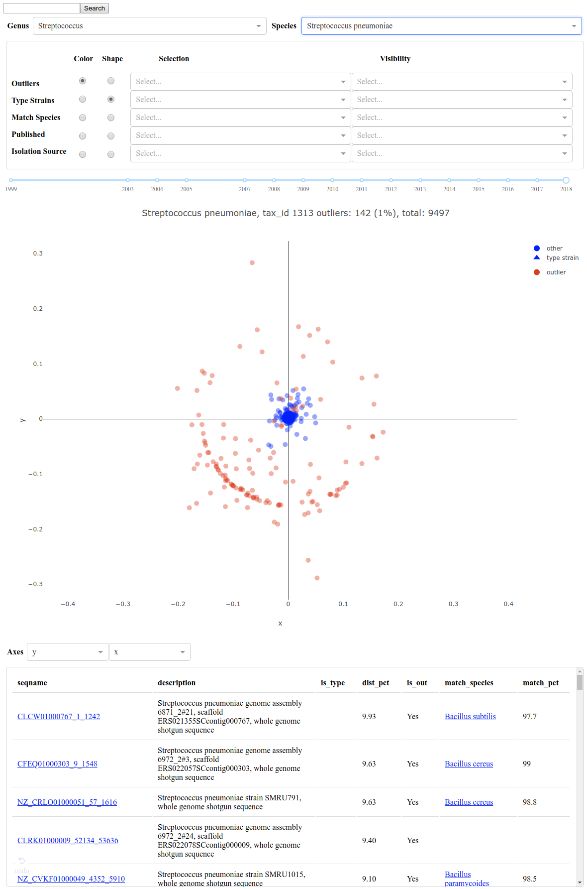

===============================================
NCBI Species Level 16s Reference Sequence Plots
===============================================

Web Site: https://ya16sdb.labmed.uw.edu/
Github: https://github.com/crosenth/ya16sdb-dash

Authors: Noah Hoffman, Chris Rosenthal, Nik Krumm

Summary of features
===================

Users can browse Bacteria and Archea species using the Genus and 
Species dropdown menus.  Users can also search for sequences by 
seqname, species taxonomy id, or species taxonomy name using the 
search box or by url arguments.  Users can modify scatter plot markers 
by color and shape and use the Selection and Visibility drop down menus
to increase the size or visibility of the markers respectively.  Both
the Selection menu and plot selection tool will update the data table
below the plot layout and Axes dropdown menus.

Ploty Dash
==========

This application uses Plotly Dash and can be run at the command line::

  python3 app.py

For more information about running a Plotly Dash app see their wiki: https://dash.plotly.com/

wiki
============

For additional development tips:

https://github.com/crosenth/ya16sdb-dash/wiki
